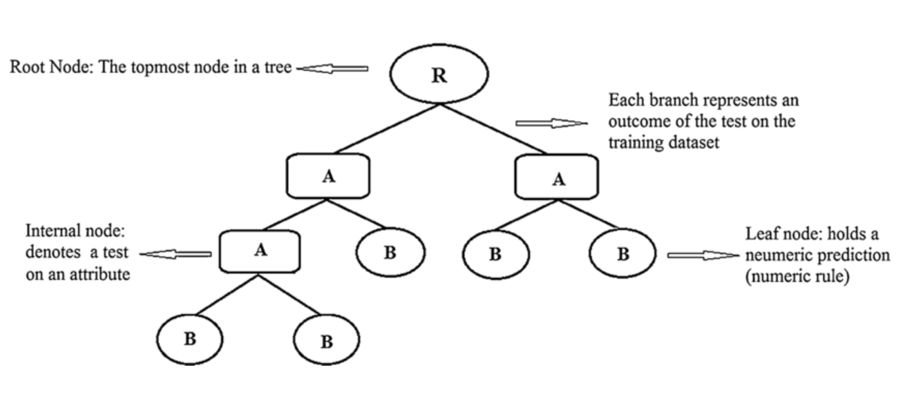

# E-commerce Fraud Detection
It is very important that predict fraud this industry could save a lot of money. Last year show successful retail fraud attempts to grow by 30%.
  In our project,’ XYZ’ is the largest e commerce company with its operation in several countries. The number of fraudster merchants are  also more. We have to create analytical model to detect fraud merchant based on attributes given.
  

### Challenge handled:
 Retriving country from ip-address is major challenge. Used geolite2 library to retrive the country from given ip-address
 Handling of imbalanced data
 
    
## Models Built:
#### Logistic Regression
#### DecisionTree
#### RandomForest
#### SVM

### DecisionTree schematic diagram

